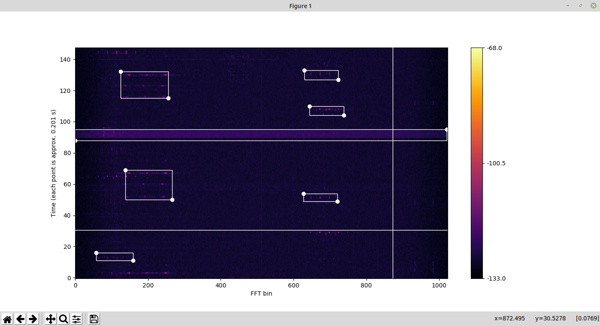

# Spectrum labeling tool
This tool enables generating training datasets for machine learning algorithms that aim to learn from spectrum waterfall plots. The tool presents random excerpts of the spectrum to the user and records manually input rectangle labels.



## Getting started

The rest of this section assumes a Linux machine is being used.

### Prerequisites

Python3 is required to run this tool. To install dependencies run:

    $ pip install numpy matplotlib Pillow

Before running the tool, input data files in an appropriate format (see section **Data**) must be specified using the `spectrum_f_names` parameter.

### Usage

To start the tool, run the following command:

    $ python spectrum_labeler.py

To record a label, use the left mouse button: click, hold, draw a rectangle and release the mouse button. To undo, press the right mouse button. Press *space* to display the next spectrogram. At the end of the labeling procedure, the tool outputs a file containing recorded labels.

## Parameters

The following parameters may be configured inside the `spectrum_labeler.py` file:

* `base_data_path` - The base data path for input spectrum files.
* `spectrum_f_names` - Input spectrum files' names.
* `output_directory` - Tool's output directory.
* `window_duration` - Length (in seconds) of random spectrum excerpts presented to the user.
* `rand_skip_forward_range` - Interval (in seconds) from which the distance between two consecutive spectrum excerpts is uniformly randomly selected.
* `noise_cutoff` - Sets the spectrogram values that are below *noise floor + noise_cutoff* to *noise floor*.


## Data

The input files should be in *JSONL* format with an object on each line having the following properties: `Time` (ISO 8691 datetime format, *yyyy-mm-ddThh:mm:ss.ffffff*) and `Measurements` (array of power measurements in dBm). Example:
```
{"Time":"2017-06-06T00:00:00.032083","Measurements":[-126, -125, -125, ..., -126, -126, -126]}
{"Time":"2017-06-06T00:00:00.259549","Measurements":[-129, -131, -131, ..., -130, -130, -129]}
...
{"Time":"2017-06-06T00:20:17.617085","Measurements":[-130, -130, -131, ..., -130, -130, -130]}
```

Recorded labels are output to a specified directory using the same file name as corresponding input files with a prepended word *out*. The format is as follows:
```
1496700657.135960 1496700686.904408
{'StartChannel': 241, 'EndChannel': 507, 'StartTime': 1496700671.218505, 'EndTime': 1496700677.859333}
{'StartChannel': 651, 'EndChannel': 786, 'StartTime': 1496700664.753048, 'EndTime': 1496700669.790228}
...
{'StartChannel': 74, 'EndChannel': 142, 'StartTime': 1496700662.348393, 'EndTime': 1496700662.974746}

1496701299.129764 1496701328.897681
{'StartChannel': 756, 'EndChannel': 921, 'StartTime': 1496701309.778328, 'EndTime': 1496701314.414673}
{'StartChannel': 645, 'EndChannel': 750, 'StartTime': 1496701315.21587, 'EndTime': 1496701315.843185}
...
{'StartChannel': 2, 'EndChannel': 1022, 'StartTime': 1496701308.175178, 'EndTime': 1496701309.377631}

...
```
For each spectrum excerpt, UNIX timestamp of first and last displayed data point is recorded. Following is a list of labels, where `StartChannel` and `EndChannel` represent the first and last FFT bin of the label respectively and `StartTime` and `EndTime` represent the start and stop time (UNIX timestamp) of the label respectively.

An example spectrum dataset together with generated labels is available at http://log-a-tec.eu/datasets.


## Author and license

Spectrum labeling tool was developed by Timotej Gale,
**timotej.gale@ijs.si**.

Copyright (C) 2019 SensorLab, Jožef Stefan Institute http://sensorlab.ijs.si

This program is free software: you can redistribute it and/or modify it under
the terms of the GNU General Public License as published by the Free Software
Foundation, either version 3 of the License, or (at your option) any later
version.

This program is distributed in the hope that it will be useful, but WITHOUT ANY
WARRANTY; without even the implied warranty of MERCHANTABILITY or FITNESS FOR A
PARTICULAR PURPOSE.  See the GNU General Public License for more details.

You should have received a copy of the GNU General Public License along with
this program. If not, see http://www.gnu.org/licenses
